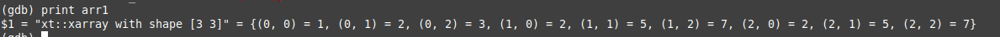
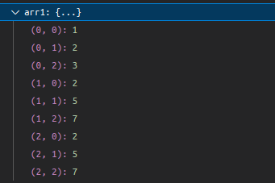

# Pretty printer for xtensor in gdb

This project aims to provide pretty printer for xtensor containers in gdb. For now it only supports evaluated xtensor containers, xexpressions aren't handled by this script.
In gdb you can use `print` command to print xtensor container. It will print shape of container and values of each element with subscripts. \
 \
Vscode also supports this pretty printer. Values will be printed in watch window. \
 \
In `testing_prg` directory is simple program that can be used to test this pretty printer. It can be compiled with `build_script.sh`. \

## Initialize pretty printer at startup

Setup system-wide gdbinit. Init file should be located at '/etc/gdb/gdbinit'.
Append folowing lines:

``` bash
add-auto-load-safe-path ~/.config/gdb/.gdbinit # enables to use file from other location
source ~/.config/gdb/.gdbinit # will use file specified at each startup
```

Then create .gdbinit file in home directory.

``` bash
mkdir ~/.config/gdb
touch ~/.config/gdb/.gdbinit
```

Append to .gdbinit in home directory.

``` bash
source <path to printer script>
```

Pretty printer should now be loaded each time gdb is launched.
